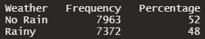

```{r setup, include=FALSE}
knitr::opts_chunk$set(echo = FALSE, message=FALSE, warning=FALSE)
pacman::p_load(modelsummary, gt, knitr, kableExtra, tidyverse,huxtable)

#Source code 
list.files('code/', full.names = T, recursive = T) %>% as.list() %>% walk(~source(.))

#Read in Data 
london_weather <- read_csv("~/OneDrive - Stellenbosch University/22211187/data/London/london_weather.csv", 
    col_types = cols(date = col_date(format = "%Y%m%d")))
```

\newpage

# Introduction {-}
There are so many reasons not to move to London but in this document I will name but a few. London is cold, London in rainy and third, there is a zero percent change of running into me. 


# Do you really like wet socks? {-}

It rains nearly 50% of the time! The amount of rain in London  basically guarantees you'll be stomping in puddles and going to work with wet socks. Do you really like wet socks? (Note: I kept receiving the error: Error in dir.exists(lib.loc) : invalid filename argument and i couldn't fix it in time so I just screengrabbed the tables so I could knit my markdown, the code for the table is in "frequencytable.R").

## Table 1: The frequency of rainy days in London  {-}




# Wet and cold? No thank you {-}

Not only is London super wet. It is also super cold. Where the average annual temperature in London is a chilly 12.7 degrees, in sunny South Africa it is 17.5 degrees. From the graph below it is clear than many days are spent below the average in London.

## Figure 1: The average tempreture in London in 2020 {-}

```{r}
graph1<-tempretureplot(london_weather)
graph1
```

# There's a lot of snow in London {-}
The maximum snow depth in London is taller than a small cat, this is an illustration of what that might look like. 

```{r}
graph2<-maxsnowdepthplot(london_weather)
graph2
```


