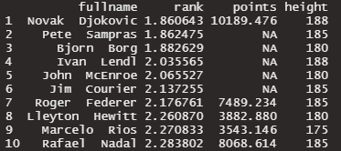
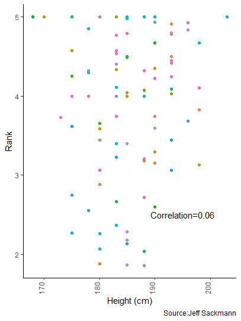
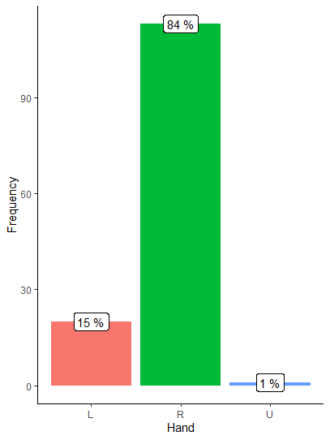

# Introduction

This document is the README for my Data Science 871 Practical. My
approach to the various questions will be detailed here although if
anything doesn’t make sense here it is detailed in the README’s in the
respective question folders(e.g. Question_1).

To start I created Texevier html templates for all the questions using
the standard code:

``` r
Texevier::create_template_html(directory="", template_name = "")
```

# Question 1 Solution

## Load the data

For this question, there was a lot of missing data and the data is super
confusing, so the first thing I did was to look at the unique values in
each column to try figure out what was going on. It seems like the
location column contains continents as well as individual countries and
income designations. Considering that our first task was to try to
compare Africa to the other countries, I thought it was a good idea to
extract the continent information from the location column, but the
entries with a continent in the location column had no data for the
other columns, making this approach futile. I really wanted to get a
measure of total cases per million per continent to show the comparison.
Thus I needed to instead get the location column to a country column and
then average the values over all the countries in a particular
continent. This is what I did in the function “barplotcases”.

## Africa’s experience

One might assume that Africa would be hardest hit by the Covid-19
pandemic given the high levels of poverty and inequality present in many
of the countries in the region. To investigate this, one can look at a
number of metrics. The left pane of the figure below shows the average
total number of cases experienced by a continent, the average excludes
those countries for which no data on total cases was available. One can
see that this appears to show a suprising story, that Africa experienced
the least Covid-19 cases per million inhabitants out of all the
continents. This is not surprising though when you delve a little
deeper. Consider the right pane, it shows that Africa also has the
lowest average total tests per thousand inhabitants. This indicates that
the reason Africa’s Covid-19 numbers are so low might not be due to a
lack of actual cases, but rather a failure to adequately test for the
virus.

### Figure 1: Africa has had the fewest cases but also the fewest tests


Another stark illustration of some of the problems Africa has
experienced in collecting data on the pandemic is the case of Tanzania.
This is not a case of a lack of resources, like it is for testing, but
rather, a lack of leadership. The president declared the pandemic to be
over early in 2020 and thereafter stopped recording cases, this is why
we see the total cases for Tanzania remaining close to zero for much of
2020 and 2021. It was only when the new president came into power that
cases began to be recorded again, hence the jump in late 2021.

### Figure 2: Covid cases in Tanzania


Both these figures illustrate a need for caution in making blanket
statements about how certain countries or regions fared during Covid-19.
Without adequate understanding of the limitations of the dataset
provided, one might certainly be inclined to conclude that Africa got
off relatively lightly with regard to Covid-19 or that Tanzania had
barely any Covid cases for the first two years of the pandemic. This
could be an interesting topic to discuss, with more examples of where
data might be confusing to readers at face value.

## Poverty and the pandemic

This failure of the data to capture the true impacts of the pandemic
extends beyond just Africa. Testing has tended to be more limited in
lower income countries as well. From this data set we can obtain average
case numbers and deaths per income level, these are displayed in the
figure below. It once again shows the counter-intuitive conclusion that
lower income countries experienced lower case levels and lower deaths.
Although it is plausible that the lower rates of travel in lower income
countries might have suppressed cases initially, it is unlikely that
this effect would’ve remained throughout the pandemic. Thus, the graphs
below illustrate the problems with data collection from resource light
nations.

### Figure 3: Lower income countries report the least cases but also the least tests


## Life expectancy

There is clearly a positive relationship between average life expectancy
and total cases. This could be due to correlations with levels of
development and accordingly resources available for testing, or due to
the abundance of elderly people who were more at risk of Covid-19.

### Figure 4: Life expectancy and total cases


## Covid response

One can see from this figure that limited data is available on
hospitalizations and ICU admissions across regions. For those regions
for which data is available, it can be seen that Asia and South America
appear not to vary their hospital beds per thousand vary much, Europe
does appear to pick up hospital beds following the first wave but there
is relatively little movement after that.

### Figure 5: ICU admissions per million and hospital beds per thousand for regions with data


# Question 2 Solution

## Introduction

The key things to get across here is that London is in fact cold and
wet. I think the best way to express that it is wet is to calculate the
frequency of days in which it rained vs days in which it didn’t rain so
that I can convince her that it rains a lot of the time. For the cold
part of the equation some kind of temperature plot will be optimal.
There is a lot of data so I think it will be best to restrict it to the
most recent year and then plot the average temperatures for the year.
Here it will be necessary to provide some sort of comparison, so I
obtained the average annual temperature for South Africa (World Bank,
2022). I also provided a plot of the snow depth for some humour.

## Read in data

## Do you really like wet socks?

There are so many reasons not to move to London but in this document I
will name but a few. London is cold, London in rainy and third, there is
a zero percent change of running into me. It rains nearly 50% of the
time! The amount of rain in London basically guarantees you’ll be
stomping in puddles and going to work with wet socks. Do you really like
wet socks?

### Table 1: The frequency of rainy days in London

<table>
<thead>
<tr>
<th style="text-align:left;">
Weather
</th>
<th style="text-align:right;">
Frequency
</th>
<th style="text-align:right;">
Percentage
</th>
</tr>
</thead>
<tbody>
<tr>
<td style="text-align:left;">
No Rain
</td>
<td style="text-align:right;">
7963
</td>
<td style="text-align:right;">
100
</td>
</tr>
<tr>
<td style="text-align:left;">
Rainy
</td>
<td style="text-align:right;">
7372
</td>
<td style="text-align:right;">
100
</td>
</tr>
</tbody>
</table>

## Wet and cold? No thank you

Not only is London super wet. It is also super cold. Where the average
annual temperature in London is a chilly 12.7 degrees, in sunny South
Africa it is 17.5 degrees. From the graph below it is clear than many
days are spent below the average in London.

### Figure 1: The average tempreture in London in 2020


## There’s a lot of snow in London

The maximum snow depth in London is deeper than a kitten, this is an
illustration of what a kitten stuck in that snow might look like,
doesn’t that make you sad?


# Question 3 Solution

## Introduction

This dataset repeatedly crashed my computer so I was unable to read the
data in using my function. I had to instead run all the elements of my
function manually so that I could complete the rest of the analysis. As
such. The figures that I created won’t display properly through code
here, but you can go and run them as individual functions or check their
code in the Question_3\_correct folder. I will include screenshots of
the output here.

## Top players by points

In terms of points, none of the top players are particularly familiar.
Neither Djokovic or Nadal appear among the top 10 players as is seen in
Table 1 below.

### Table 1: Top 10 tennis players of all time by points


## Top players by rank

The top players in terms of rank are more familiar. Unfortunately my
favorite Nadal does only come in at 10th, far behind Djokavic who holds
the first position.

### Table 2: Top 10 tennis players of all time by ranking



## Do you have to be tall to be a good tennis player?

Although the scatter plot below illustrates that there is limited
correlation between a players height and their ranking. All the top
players appear to taller than 170cm. The average South African male is
169cm and thus, the average South African man is definitely not going to
be a pro tennis player.

### Figure 1: The height and rank of top tennies players



## Do lefties play tennis?

Lefties seem to be relatively good at tennis, making up 13% of the top
tennis players but only 10% of the population.


# Question 4 Solution

# Introduction

# Most popular shows and movies

A good place to start in explaining what works and what doesn’t work for
a streaming platform is to look at what shows and movies do well on the
platform. The metric for performance that is going to be used here is
the TMDB popularity as it aggregates important metrics likes the number
of votes and views for a movie or show. The top 10 movies and shows are
shown in the tables below. The movie table provides valuable insights
into possible explanations for movies performance, it seems as though
longer movies may perform a bit better, romances and thrillers seem to
be popular, and the TMDb score seems to be relatively important although
that is expected given that it is an input into popularity. For series,
the most popular titles appear to have slightly above the average run
time for series of 40 minutes. Drama appears to be the most popular
primary genre among top series.

## Table 1: Top 10 most popular movies

<table>
<thead>
<tr>
<th style="text-align:left;">
Title
</th>
<th style="text-align:right;">
Runtime
</th>
<th style="text-align:right;">
IMDb Score
</th>
<th style="text-align:right;">
TMDb Score
</th>
<th style="text-align:left;">
Primary genre
</th>
<th style="text-align:right;">
Popularity
</th>
</tr>
</thead>
<tbody>
<tr>
<td style="text-align:left;">
365 Days: This Day
</td>
<td style="text-align:right;">
111
</td>
<td style="text-align:right;">
2.5
</td>
<td style="text-align:right;">
5.6
</td>
<td style="text-align:left;">
romance
</td>
<td style="text-align:right;">
1823
</td>
</tr>
<tr>
<td style="text-align:left;">
Yaksha: Ruthless Operations
</td>
<td style="text-align:right;">
125
</td>
<td style="text-align:right;">
6.2
</td>
<td style="text-align:right;">
6.2
</td>
<td style="text-align:left;">
action
</td>
<td style="text-align:right;">
1275
</td>
</tr>
<tr>
<td style="text-align:left;">
Black Crab
</td>
<td style="text-align:right;">
114
</td>
<td style="text-align:right;">
5.6
</td>
<td style="text-align:right;">
6.2
</td>
<td style="text-align:left;">
war
</td>
<td style="text-align:right;">
944
</td>
</tr>
<tr>
<td style="text-align:left;">
The Adam Project
</td>
<td style="text-align:right;">
106
</td>
<td style="text-align:right;">
6.7
</td>
<td style="text-align:right;">
7.0
</td>
<td style="text-align:left;">
drama
</td>
<td style="text-align:right;">
920
</td>
</tr>
<tr>
<td style="text-align:left;">
Fistful of Vengeance
</td>
<td style="text-align:right;">
94
</td>
<td style="text-align:right;">
4.5
</td>
<td style="text-align:right;">
5.4
</td>
<td style="text-align:left;">
fantasy
</td>
<td style="text-align:right;">
829
</td>
</tr>
<tr>
<td style="text-align:left;">
Honeymoon With My Mother
</td>
<td style="text-align:right;">
110
</td>
<td style="text-align:right;">
5.8
</td>
<td style="text-align:right;">
6.3
</td>
<td style="text-align:left;">
comedy
</td>
<td style="text-align:right;">
642
</td>
</tr>
<tr>
<td style="text-align:left;">
Battle: Freestyle
</td>
<td style="text-align:right;">
88
</td>
<td style="text-align:right;">
4.3
</td>
<td style="text-align:right;">
4.9
</td>
<td style="text-align:left;">
romance
</td>
<td style="text-align:right;">
571
</td>
</tr>
<tr>
<td style="text-align:left;">
Last Man Down
</td>
<td style="text-align:right;">
87
</td>
<td style="text-align:right;">
5.0
</td>
<td style="text-align:right;">
6.3
</td>
<td style="text-align:left;">
thriller
</td>
<td style="text-align:right;">
506
</td>
</tr>
<tr>
<td style="text-align:left;">
Restless
</td>
<td style="text-align:right;">
95
</td>
<td style="text-align:right;">
5.8
</td>
<td style="text-align:right;">
6.0
</td>
<td style="text-align:left;">
thriller
</td>
<td style="text-align:right;">
494
</td>
</tr>
<tr>
<td style="text-align:left;">
Texas Chainsaw Massacre
</td>
<td style="text-align:right;">
83
</td>
<td style="text-align:right;">
4.8
</td>
<td style="text-align:right;">
5.1
</td>
<td style="text-align:left;">
thriller
</td>
<td style="text-align:right;">
438
</td>
</tr>
</tbody>
</table>

## Table 2: Top 10 most popular series

<table>
<thead>
<tr>
<th style="text-align:left;">
Title
</th>
<th style="text-align:right;">
Runtime
</th>
<th style="text-align:right;">
IMDb Score
</th>
<th style="text-align:right;">
TMDb Score
</th>
<th style="text-align:left;">
Primary genre
</th>
<th style="text-align:right;">
Popularity
</th>
<th style="text-align:right;">
Seasons
</th>
</tr>
</thead>
<tbody>
<tr>
<td style="text-align:left;">
The Marked Heart
</td>
<td style="text-align:right;">
44
</td>
<td style="text-align:right;">
6.3
</td>
<td style="text-align:right;">
6.8
</td>
<td style="text-align:left;">
thriller
</td>
<td style="text-align:right;">
1455
</td>
<td style="text-align:right;">
2
</td>
</tr>
<tr>
<td style="text-align:left;">
Wheel of Fortune
</td>
<td style="text-align:right;">
26
</td>
<td style="text-align:right;">
6.7
</td>
<td style="text-align:right;">
6.7
</td>
<td style="text-align:left;">
family
</td>
<td style="text-align:right;">
1441
</td>
<td style="text-align:right;">
39
</td>
</tr>
<tr>
<td style="text-align:left;">
Grey’s Anatomy
</td>
<td style="text-align:right;">
49
</td>
<td style="text-align:right;">
7.6
</td>
<td style="text-align:right;">
8.3
</td>
<td style="text-align:left;">
drama
</td>
<td style="text-align:right;">
1215
</td>
<td style="text-align:right;">
18
</td>
</tr>
<tr>
<td style="text-align:left;">
Peaky Blinders
</td>
<td style="text-align:right;">
58
</td>
<td style="text-align:right;">
8.8
</td>
<td style="text-align:right;">
8.6
</td>
<td style="text-align:left;">
drama
</td>
<td style="text-align:right;">
972
</td>
<td style="text-align:right;">
6
</td>
</tr>
<tr>
<td style="text-align:left;">
Heartstopper
</td>
<td style="text-align:right;">
28
</td>
<td style="text-align:right;">
8.9
</td>
<td style="text-align:right;">
8.9
</td>
<td style="text-align:left;">
drama
</td>
<td style="text-align:right;">
926
</td>
<td style="text-align:right;">
1
</td>
</tr>
<tr>
<td style="text-align:left;">
The Walking Dead
</td>
<td style="text-align:right;">
46
</td>
<td style="text-align:right;">
8.2
</td>
<td style="text-align:right;">
8.1
</td>
<td style="text-align:left;">
action
</td>
<td style="text-align:right;">
773
</td>
<td style="text-align:right;">
11
</td>
</tr>
<tr>
<td style="text-align:left;">
Lucifer
</td>
<td style="text-align:right;">
47
</td>
<td style="text-align:right;">
8.1
</td>
<td style="text-align:right;">
8.5
</td>
<td style="text-align:left;">
scifi
</td>
<td style="text-align:right;">
761
</td>
<td style="text-align:right;">
6
</td>
</tr>
<tr>
<td style="text-align:left;">
The Flash
</td>
<td style="text-align:right;">
42
</td>
<td style="text-align:right;">
7.6
</td>
<td style="text-align:right;">
7.8
</td>
<td style="text-align:left;">
scifi
</td>
<td style="text-align:right;">
751
</td>
<td style="text-align:right;">
8
</td>
</tr>
<tr>
<td style="text-align:left;">
All of Us Are Dead
</td>
<td style="text-align:right;">
61
</td>
<td style="text-align:right;">
7.5
</td>
<td style="text-align:right;">
8.5
</td>
<td style="text-align:left;">
action
</td>
<td style="text-align:right;">
679
</td>
<td style="text-align:right;">
1
</td>
</tr>
<tr>
<td style="text-align:left;">
Conversations with a Killer: The John Wayne Gacy Tapes
</td>
<td style="text-align:right;">
61
</td>
<td style="text-align:right;">
7.2
</td>
<td style="text-align:right;">
7.8
</td>
<td style="text-align:left;">
crime
</td>
<td style="text-align:right;">
535
</td>
<td style="text-align:right;">
1
</td>
</tr>
</tbody>
</table>

Now that we understand some of the broad factors that feed into a series
being popular. It is necessary to conduct a more granular analysis,
delving into specific factors.

# Most popular genres

Peoples preferences for entertainment are often influenced by the
preferences for a particular genre of content. Understanding which
genres are most popular would be helpful in determining which content to
prioritise on the streaming platform. The graph below shows the 10 most
popular genres by median TMDb popularity. Median was chosen to minimize
the effects outliers have on results. It is clear from the graph that
animation, crime and sport are the most popular genres and thus these
should be prioritized when creating a new streaming platform.

## Figure 1: Genres


# Correlations

Correlations between the various variables can help us undertand what
matters for a shows popularity. The correlation plot below clearly
illustrates that there is a strong positive correlation between the IMDb
score and the TMDb score, as well as a relatively strong negative
correlation between the TMDb score and the runtime. This suggests that
shows with a shorter run time might score better overall. Ideally
though, this should be plotted separately for movies and series as these
have significantly different run times and combining them in one plot
might confuse the relationship between run time and the other variables.

## Figure 2: Correlations


# Conclusion

What is clear from the above analysis is that the company must carefully
consider genres as well as a title’s IMDb and TMDb ratings when deciding
to load titles onto the streaming platform. Variables like run time
should also be considered although what is optimal is less clear.
Further analysis is necessary before we commence the buying of titles.

    ##           used (Mb) gc trigger  (Mb) max used  (Mb)
    ## Ncells 1453717 77.7    2721221 145.4  2721221 145.4
    ## Vcells 2870236 21.9   42324883 323.0 52876963 403.5
